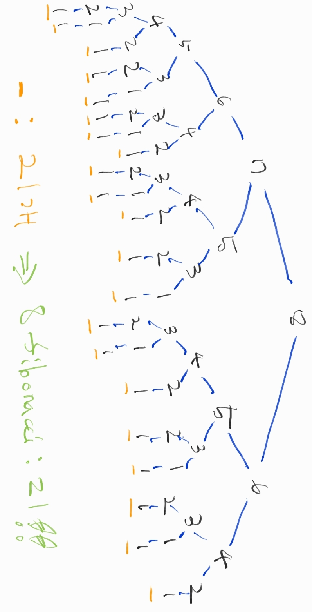

[여기에요!!](https://github.com/KihyunLim/coding-test/blob/master/udemy/status.md)

### clear status

- [x] [section5-1_validAnagram](./section5-1_validAnagram.js)
- [x] [section5-2_countUniqueValues](./section5-2_countUniqueValues.js)
- [x] [section6-1_sameFrequency](./section6-1_sameFrequency.js)
- [x] [section6-2_Multiple Pointers - areThereDuplicates](./section6-2_Multiple%20Pointers%20-%20areThereDuplicates.js)
- [ ] [section6-3_averagePair](./section6-3_averagePair.js)
- [ ] [section6-4_isSubsequence](./section6-4_isSubsequence.js)
- [ ] [section6-5_maxSubarraySum](./section6-5_maxSubarraySum.js)
- [ ] [section6-6_minSubArrayLen](./section6-6_minSubArrayLen.js)
- [ ] [section6-7_findLongestSubstring](./section6-7_findLongestSubstring.js)
- [x] [section8-1_power](./section8-1_power.js)
- [x] [section8-2_factorial](./section8-2_factorial.js)
- [x] [section8-3_productOfArray](./section8-3_productOfArray.js)
- [x] [section8-4_recursiveRange](./section8-4_recursiveRange.js)
- [x] [section8-5_fib](./section8-5_fib.js)
  - 221106
- [x] [section9-1_reverse](./section9-1_reverse.js)
- [x] [section9-2_isPalindrome](./section9-2_isPalindrome.js)
  - 221106
- [x] [section9-3_someRecursive](./section9-3_someRecursive.js)
- [x] [section9-4_flatten](./section9-4_flatten.js)
  - 221106
- [x] [section9-5_capitalizeFirst](./section9-5_capitalizeFirst.js)
- [x] [section9-6_nestedEvenSum](./section9-6_nestedEvenSum.js)
- [x] [section9-7_capitalizeWords](./section9-7_capitalizeWords.js)
- [x] [section9-8_stringifyNumbers](./section9-8_stringifyNumbers.js)
  - 221108
- [x] [section9-9_collectStrings](./section9-9_collectStrings.js)

### 개념 정리
##### section8-5_fib
